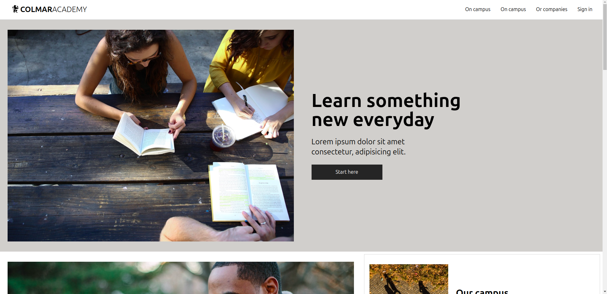
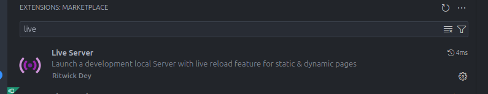

# 36-thiramet-colmar
This is assesment for bootcamp genaration thailand




# Step 1 : Start this project with git clone
```bash
    git clone git@github.com:thiramet27/36-thiramet-colmar.git
```
# Step 2 : install tailwind css by using npm
    ```
    npm init -y
    ```
    ```
    npm install tailwindcss postcss autoprefixer
    ```
    ```
    npx tailwindcss init -p
    ```

    nvim tailwind.config.js and fix line 3
    ```
    content: ["./index.html", "./src/**/*.{html,js}"],
    ```
    mkdir src

    cd src

    nvim input.css and put
    ```
    @tailwind base;
    @tailwind components;
    @tailwind utilities;
    ```

    mkdir dist
    nvim tailwind.config modified content: with
    ```
    content: ["./index.html", "./src/**/*.{html,js}"],
    ```
    nvim package.json add line 8 with
    ```
    "build": "tailwindcss -i ./src/input.css -o ./dist/output.css --watch"
    ```
    run
    ```
    npm run build

# Step 3 : using extension live server in vs code


Click 'Go live' and go to port 5500

    ```
    http://localhost:5500/colmar/
    ```
 
